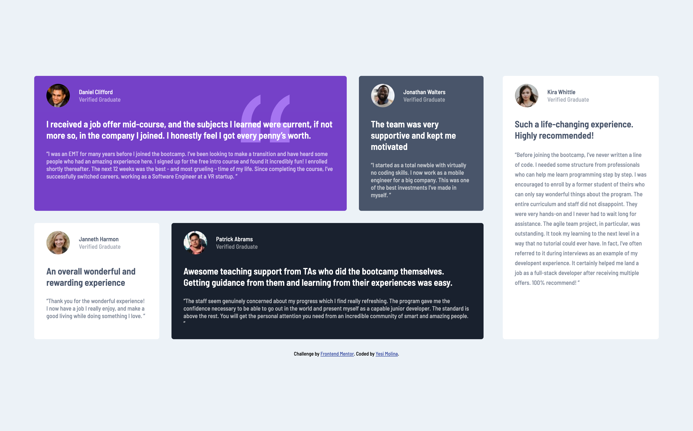

# Frontend Mentor - Testimonials grid section solution

This is a solution to the [Testimonials grid section challenge on Frontend Mentor](https://www.frontendmentor.io/challenges/testimonials-grid-section-Nnw6J7Un7). Frontend Mentor challenges help you improve your coding skills by building realistic projects. 

## Table of contents

- [Overview](#overview)
  - [The challenge](#the-challenge)
  - [Screenshot](#screenshot)
  - [Links](#links)
- [My process](#my-process)
  - [Built with](#built-with)
  - [What I learned](#what-i-learned)
  - [Continued development](#continued-development)
  - [Useful resources](#useful-resources)
- [Author](#author)


## Overview

### The challenge

Users should be able to:

- View the optimal layout for the site depending on their device's screen size

### Screenshot

#### Phone


#### Tablet


#### Desktop




### Links

- Solution URL: [GitHub Pages](https://yeseniamolinab.github.io/testimonials-grid-section-main/)

## My process

### Built with

- Semantic HTML5 markup
- CSS
- Flexbox
- CSS Grid (For the phone view)

### What I learned

The main key learnings from this challenge were practicing the css grid to center the page content:

```css
body {
        display: grid;
        place-content: center;
        min-height: 100vh;
    } 
```
Also I liked that I practiced the use of pseudo elements to apply specific styles to some of the testimonials cards:

```css
.container > div:first-child, .container > div:nth-last-child(2) {
    width: 50%;
}
```

### Continued development

* Need to practice more the css grid
* Positioning elements outside the flow, like I did with the quotationg svg.

### Useful resources

- [learncssgrid](https://learncssgrid.com/) - This helped me to quickly understand the css grid and have the properties at hand.
- [tobiasahlin.com](https://tobiasahlin.com/blog/flexbox-break-to-new-row/) - This is an amazing article which helped me to break flex box content to a new row.

## Author

- Frontend Mentor - [@yeseniamolinab](https://www.frontendmentor.io/profile/yeseniamolinab)
- Twitter - [@yeseniamolinab](https://www.twitter.com/yeseniamolinab)

